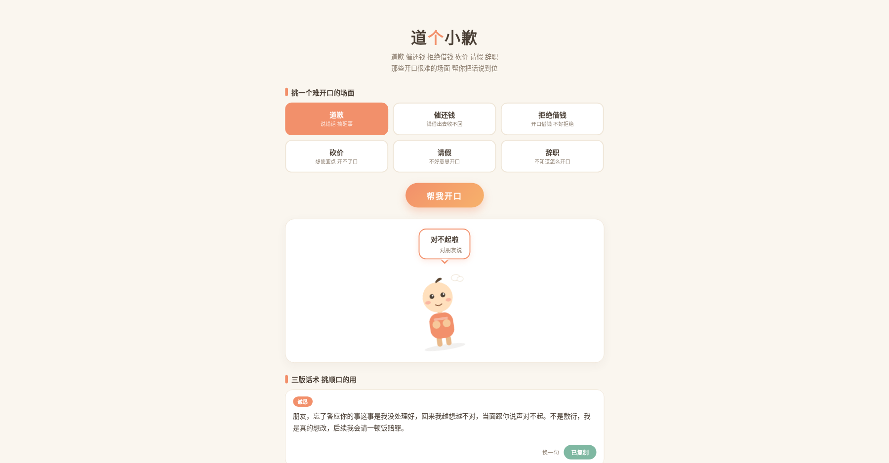

# 道个小歉 · 开口难救场器

道歉、催还钱、拒绝借钱、砍价、请假、辞职……那些开口很难的场面，帮你把话说到位。可爱小人陪你开口。

纯本地运行：**不联网、不依赖任何 API、不收集任何数据**，双击 `index.html` 就能用。



## ✨ 功能

- **6 大难开口场景**：道歉 / 催还钱 / 拒绝借钱 / 砍价 / 请假 / 辞职
- **每场景 3 版话术**：诚恳版、幽默版、正式版，随机组合不重样
- **可编辑**：话术里的对象、事件都能点开改，改完一键复制
- **可爱道歉小人**：鞠躬、脸红、冒汗的 SVG 小人陪你开口
- **零依赖零成本**：单文件 HTML，无框架、无构建、无后端

## 🚀 快速开始

### 本地使用

```bash
git clone https://github.com/<你的用户名>/xiaodaoqian.git
cd xiaodaoqian
# 直接双击 index.html 即可，或用任意静态服务器
python3 -m http.server 8000
# 浏览器打开 http://localhost:8000
```

### 部署到 GitHub Pages（可选）

1. 把项目推到 GitHub（见下）
2. 仓库 Settings → Pages → Source 选 `main` 分支根目录
3. 几分钟后访问 `https://<你的用户名>.github.io/xiaodaoqian/`

## 🔧 自定义话术

打开 `index.html`，找到 `SCENES` 数组，按同样的结构加场景、加模板、加词库：

```js
{
  id: "your_scene",
  name: "你的场景",
  desc: "一句话描述",
  targets: ["对象A", "对象B"],
  events: ["事情A", "事情B"],
  fixes: ["补救A"],          // 可选，模板里用到 {fix} 才需要
  templates: [
    {tag: "诚恳", cls: "cheng", tpl: "{target}，{event}……"},
    {tag: "幽默", cls: "humor", tpl: "……"},
    {tag: "正式", cls: "formal", tpl: "……"}
  ]
}
```

支持的占位符：`{target}` 对象、`{event}` 事件、`{fix}` 补救措施。

## 📦 项目结构

```
xiaodaoqian/
├── index.html      # 全部代码（HTML + CSS + JS）
├── README.md
└── screenshot.png  # 预览图（可选）
```

## 🤝 贡献

- 加场景、加话术模板、优化小人动画，都欢迎提 PR
- 发现 bug 直接提 issue

## 📄 License

[MIT](LICENSE) © 2026 刘浩然

---

喜欢的话点个 ⭐，转发给那个"开口很难"的朋友，就是对我最大的支持。
